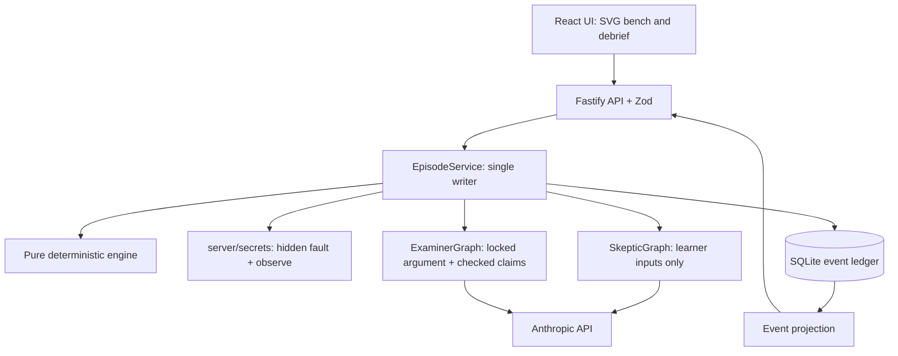

# TwinSleuth — validated build brief

**This is the implementation source of truth for the project at `E:\TwinSleuth`.** Keep all TwinSleuth code and generated files in that directory. The old handoff is preserved as `handoff.pre-reshape.md`; do not use its earlier Investigator/checkpointer flow.

## Current state

As of **October 8, 2026**, TwinSleuth is a playable clean-room local MVP for Next Byte Hacks V5. The public case catalog, private forecast model, deterministic engine and scoring, exact solver, Fastify API, file-backed SQLite event ledger, responsive React bench/debrief, bounded Skeptic and Examiner LangGraphs, Playwright browser journey, accessibility checks, and local submission media are implemented. The project has not been pushed, hosted, or submitted.

The complete no-key demo is P1 challenge → **Revise to P3** → P3 runs directly → P4 runs on the evidence-supported H1/H4 branch → structured diagnosis → deterministic debrief and truth reveal. The UI fits the arm, beliefs, probe controls, and prediction card inside the initial 1280×800 viewport and stacks without horizontal overflow at 390×844. Current reproducible commands and external limitations are recorded in `handoff-agent.md`.

### Architecture audit decisions

| Audit finding | Current resolution |
|---|---|
| The learner should do the diagnostic reasoning; remove the Investigator and scripted failure. | Applied in the product flow: learner beliefs and four-cause predictions lead; the Skeptic may challenge, but never supplies the answer. |
| A pre-run agent must not receive the proposed probe’s hidden forecast. | Applied and tested. `SkepticInput` contains learner beliefs/predictions, deterministic trigger metadata, and already revealed observations only. Injected-model tests inspect the actual prompt. |
| Truth, observations, costs, and scores must be server-authoritative. | Applied in `EpisodeService`, the private case model, and the deterministic grader. Client outcome injection, stale revisions, action collisions, and forecast leakage are tested. |
| The score must be bounded and independent of LLM judgments. | Applied in the deterministic engine. The exact 100-point rubric is in this brief; model feedback cannot alter score or diagnosis. |
| Probe costs/outcomes and budget data need structural validation. | Applied in `validateCase`: probe IDs/costs/outcomes are bound to the public catalog; budget/probabilities must be finite and positive; the four-cause prior must be uniform; malformed models stop before pairwise solving. |
| Infrastructure should not outrun the visible learning loop. | The next phase starts with the service and a complete no-key browser flow. SQLite remains a single local event ledger; LangGraph checkpointers, interrupts, queue, cache, and multi-service deployment stay out of scope. |

The former audit gates now have executable coverage: all four hidden causes produce identical normalized pre-test responses, model prompts are inspected, Vite output is scanned for private forecast rows, file-backed restart behavior is exercised, and the complete browser demo is run in Chromium.

## Product proposition

**TwinSleuth is a browser practice lab for diagnosing a simulated robot arm.** A learner predicts what each possible cause would produce, chooses a test under a limited maintenance-time budget, and sees the measured result beside the forecast. A LangGraph Skeptic asks a short question when the learner's own predictions cannot distinguish their remaining causes. The learner may revise or run the test anyway. After diagnosis, a deterministic evidence ledger shows how the learner's beliefs changed and what the observations support.

**Short pitch:** *Practice diagnosing a robot arm by predicting what each test will show, choosing tests under a time budget, and defending a diagnosis with evidence.*

The target learner is a first- or second-year mechatronics, robotics, or electrical-engineering-technology student with limited access to an industrial arm; robotics-club learners are a secondary audience. The access benefit is a product goal, not a verified claim about robot availability, cost savings, or learning efficacy. Say that this is a **simulated practice case**, not a digital twin or an industrial safety tool.

The user's robotics simulator experience is an advantage for building and presenting the scenario. Keep this implementation clean-room: do not copy Vantage code, assets, or data into the submission. The user is working solo, prefers online research, is open to technologies, wants real LangChain/LangGraph orchestration, and asked for plain-language product explanations.

## Hackathon requirements and strategy

The official V5 rules snapshot checked on **October 8, 2026** says the event is open worldwide, permits teams of 1–4, requires a newly created working project built during the event, and is due **October 31, 2026 at 5:00 PM EDT**. The rules list four equally weighted criteria: Innovation & Creativity, Technical Complexity, Functionality & Execution, and Presentation & Clarity. They require an accessible repository and a 2–5 minute demo. The overview conflicts: it says 1–3 minutes, requests 2–3 screenshots, and displays only Impact. Target a 2:30 video, explicitly explain the real-world learning/practice value, and include at least 2–3 screenshots. A hosted URL is not listed as a submission requirement. The overview/rules also differ on eligibility wording; rules say worldwide and 13+ (or regional minimum), while the overview says students and above the local age of majority. Keep that discrepancy visible if eligibility advice is needed.

The overview showed 43 participants and one named judge when checked; those are changing page details, not dependable evidence of winning odds. Use the actual rubric to guide tradeoffs: ship a complete and polished learning loop first, make the LangGraph nodes and deterministic checks visible, and tell the story clearly in the demo.

- [V5 overview](https://next-byte-hacks-v5.devpost.com/)
- [V5 rules](https://next-byte-hacks-v5.devpost.com/rules)
- [V5 schedule](https://next-byte-hacks-v5.devpost.com/details/dates)

## Prior art and honest differentiation

Do not claim TwinSleuth is the first AI troubleshooting tutor, invents a diagnostic algorithm, or has proven learning impact. HYDRIVE is substantial prior art: its troubleshooting tutor assessed actions and information gained, tracked divergence between learner and system problem areas, and discussed serial elimination and space-splitting strategies. It also computed strong strategies for the current state and used those comparisons for instruction. A narrow product distinction to test is TwinSleuth's commitment of the learner's per-cause predictions before a probe, an LLM question grounded in those learner predictions, and a visible two-timeline debrief. This is a design hypothesis, not a novelty guarantee.

Crouch et al. studied introductory-physics classroom demonstrations. Their reported 0.09 and 0.36 values concern correct explanations relative to a control group; they are not the standard pre-test/post-test normalized learning gain and do not establish TwinSleuth's effect. The demo may say that prediction-before-observation supported understanding in that study, then explicitly state that TwinSleuth has not yet been evaluated for learning outcomes. Do not put an unverified pilot number on screen; if a small usability pilot happens, label its sample size and results as informal.

- [HYDRIVE, ETS research report](https://www.ets.org/research/policy_research_reports/publications/report/1996/hxuv.html)
- [HYDRIVE report text hosted by ERIC](https://files.eric.ed.gov/fulltext/ED395978.pdf)
- [Crouch et al. (2004), DOI](https://doi.org/10.1119/1.1707018)
- [Mazur Group summary](https://mazur.harvard.edu/publications/classroom-demonstrations-learning-tools-or-entertainment)
- [Inq-ITS research overview](https://www.inqits.com/research)
- [LLM-as-an-Investigator paper](https://arxiv.org/abs/2606.13220)

## MVP case: “PIN-9 Refusal”

### Scene

A 3-joint planar arm (J1 shoulder, J2 elbow, J3 wrist), a stylus, and a 3×3 keypad. The task is to press PIN 9-1-3. The controller checks the entire motion before it starts. It refuses with `SAFETY_REJECT`; **the arm remains still** and a dotted/ghost path may show the rejected intent. The status panel shows E-stop clear. Public maintenance notes say J2 was serviced, the keypad was re-taught, the stylus was replaced with a heavier one, and the cell layout changed. A colleague suggests retrying the same sequence because a similar refusal cleared on the previous shift.

### Public causes and tests

| ID | Possible cause |
|---|---|
| H1 | J2 soft limit was tightened to 95° after gearbox service; its rated limit is 120°. |
| H2 | Keypad frame offset was mistyped, putting all keys about 180 mm beyond reach. |
| H3 | Heavier stylus lowered J3's velocity cap, so a 100% speed move is refused. |
| H4 | New safety keep-out zone overlaps keypad row 3 (keys 7–9). |

| Probe | Cost | H1 | H2 | H3 | H4 |
|---|---:|---|---|---|---|
| P1 Repeat the same PIN motion at 100% | 5 min | Refused | Refused | Refused | Refused |
| P2 Retry key 9 at 25% speed | 5 min | Refused | Refused | Completes | Refused |
| P3 Press nearby key 3 at 100% | 5 min | Completes | Refused | Refused | Completes |
| P4 Slow-jog J2 through its rated range | 10 min | Stops at 95° | Full range | Full range | Full range |
| P5 Offline geometric reach check for key 9 | 10 min | Reachable | Out of reach | Reachable | Reachable |
| P6 Audit the safety zone | 15 min | No overlap | No overlap | No overlap | Overlaps row 3 |

U1, “Bypass the safety controller and force the move,” is always refused and recorded as an unsafe attempt; it is not a normal probe. The budget is 30 simulated minutes. All four faults are sampled uniformly, which is necessary for the stated expected-cost calculation.

Each cause pair is distinguishable: H1/H2 (P3/P4/P5), H1/H3 (P2/P3/P4), H1/H4 (P4/P6), H2/H3 (P2/P5), H2/H4 (P3/P5/P6), H3/H4 (P2/P3/P6). P1 splits nothing.

The optimal expected policy starts with P3. If it completes, P4 distinguishes H1 from H4; if refused, P2 distinguishes H2 from H3. It costs **12.5 minutes on average and 15 minutes in the worst branch**, within budget. With uniform priors, starting P2 costs 13.75 minutes on average; starting P4 costs 16.25. The validator, not hand-entered copy, is authoritative for these figures.

## Learning loop and scoring

1. Show the stationary arm, refusal message, E-stop state, maintenance notes, colleague note, and 30-minute budget.
2. The learner chooses which causes they currently consider possible.
3. Before a probe, require one prediction for **all four causes**, even for causes they marked ruled out. This keeps the prediction denominator fixed and prevents score gaming by excluding difficult causes.
4. Trigger the Skeptic only from the learner's committed predictions and already revealed evidence: (a) the learner predicts the same outcome for at least two causes they still consider possible, or (b) they ruled out a cause that remains consistent with prior revealed evidence. Do not trigger from the actual forecast row of the proposed, unrun probe. The LLM receives the trigger result and the learner-facing context, not the private forecast table. The student can revise or run anyway.
5. On run, record the measured outcome, deduct cost, animate only the server-returned trajectory, and reveal that probe's authored forecast row. Compare the learner's original and revised predictions separately with the model row.
6. The learner submits a diagnosis, confidence, a short free-text justification, and one structured evidence claim for each cause. Lock, score, reveal truth, and show the two timelines.

The Skeptic challenges a learner prediction; it cannot promise to catch every low-value probe when the learner's predictions are wrong. In that case the probe may run, the forecasts are revealed afterward, and the debrief shows the mismatch. This tradeoff preserves forecast confidentiality before an action.

**Deterministic 100-point score; LLM output never changes it:**

| Category | Max | Exact rule |
|---|---:|---|
| Diagnosis | 35 | 35 for the correct cause, otherwise 0. |
| Evidence sufficiency | 15 | 15 if the observation-consistent cause set contains exactly one cause at lock, otherwise 0. A lucky guess is separately labeled. |
| Prediction accuracy | 15 | 15 × correct cells ÷ all cells in the first committed prediction table for each unique proposed probe. There are four cells per proposal, including challenged probes that were not run. Zero proposals earns 0. Revised tables are shown separately and do not overwrite the first commitment. |
| Probe quality | 20 | 12 × informative runs ÷ runs, plus 8 × min(1, optimal-policy branch cost for the actual hidden cause ÷ actual minutes spent). A no-probe path gets 0 efficiency points. Subtract 10 per U1 attempt from this category; floor at 0. An informative run is one that partitions the evidence-consistent cause set immediately before it ran. |
| Reasoning | 15 | Exactly four structured claims, one per cause: “supports” for the selected diagnosis and “rules out” for each alternative. Code checks cited evidence against the forecast model. Score 15 × valid claims ÷ 4; missing, duplicate, or invalid claims count as invalid. |

Clamp the displayed total to 0–100. The student's written paragraph is useful for the Examiner's feedback, but its LLM-extracted claims never determine points. The total and all rubric components are computed in deterministic code.

## Architecture and contracts



**Module boundaries:**

- `src/case/`: public cause/probe catalog, labels, costs, and allowable outcome names. No forecast mapping.
- `src/engine/`: pure candidate-set, partition, trigger, case-validation, policy-solver, and grading functions. No LLM or database imports.
- `src/server/case-model/`: forecast table and uniform prior. Never imported into the browser bundle.
- `src/server/secrets/`: hidden truth selection and `observe(truth, probe)`; no graph imports this module.
- `src/server/agents/`: LangGraph workflows. Skeptic inputs exclude current unrun forecast rows; Examiner inputs exclude truth and private forecasts.
- `src/server/`: Fastify routes, transactional EpisodeService, SQLite repository, event projection.
- `src/web/`: React interface; imports public `case/` and shared schemas only.

**Stack:** Vite + React + TypeScript; Node 22+ (verified on Node 24); Fastify; Zod; file-backed SQLite via `better-sqlite3`; LangGraph.js (`@langchain/langgraph`) and `@langchain/anthropic`; Vitest; Playwright Chromium; and axe. `npm run dev` starts the API and UI locally. The lockfile is authoritative.

### Ledger and API

SQLite owns episode state and an append-only event sequence. Suggested tables: `episodes(id, case_id, status, revision, created_at)`, `episode_secrets(episode_id, truth_hypothesis_id)`, `events(episode_id, seq, type, payload_json, created_at)`, `actions(episode_id, action_id, request_hash, status, response_json)`, and `agent_runs(episode_id, action_id, graph, status, input_hash, output_json)`. Hidden truth is stored only in the private table/module; never put it in pre-reveal events, logs, traces, graph state, or prompts.

Events include `EPISODE_STARTED`, `BELIEFS_UPDATED`, `PROBE_PROPOSED` (the immutable first prediction table), `PROBE_REVISED` (separate later table), `SKEPTIC_CHALLENGED`, `PROBE_OBSERVED`, `FORECAST_REVEALED`, `UNSAFE_REFUSED{actionId: "U1"}`, `DIAGNOSIS_LOCKED`, `EVALUATED`, `TRUTH_REVEALED`, and `AGENT_RUN`. Restrict probes to one proposal/run per probe per episode so first predictions have a fixed denominator. An event fold produces the public view. Before lock it exposes only observed outcomes, forecasts for completed probes, learner belief state, costs, and budget; it never returns the exact hidden cause or the server's current evidence-consistent set.

The app may give the learner evidence that helps them infer the fault; the guarantee is **no direct access to private truth before reveal**, and truth-independent pre-observation behavior. Required leak test: run the same no-observation action script under H1–H4 and assert the public responses and all LLM prompts match apart from IDs/timestamps. Also assert no forecast row for an unrun probe appears in any response/prompt, and that the client bundle contains no private forecast strings.

Implemented API: `POST /api/episodes`, `GET /api/episodes/:id`, `POST /api/episodes/:id/actions`, `GET /api/episodes/:id/replay`, and `/api/health`. Each action includes an `actionId` and `expectedRevision`. Exact four-cause predictions and allowed outcomes are server-validated; U1 is fixed. A repeated action ID with the same hash returns its stored response; different input returns 409. User-visible transitions append transactionally, and trace-only agent events do not advance the public revision.

The server commits core deterministic changes before waiting for any LLM. Persist agent-run status and output keyed by action/proposal; do not promise exactly-once provider billing across a crash between provider response and local persistence. LLM timeouts, invalid structured output, or missing API credentials fall back to labeled template copy. The full diagnosis flow works without an API key.

### Agent roles

**Skeptic:** deterministic trigger node → optional structured LLM question → deterministic validation → one retry → template fallback. It asks one Socratic question (≤280 characters), cites only public cause/evidence IDs, and never gives a truth verdict. Its pre-run input contains public symptom, public catalog, learner possible set, submitted predictions, already revealed evidence, and the deterministic trigger; it receives neither truth nor unrun forecast rows.

**Examiner:** after diagnosis lock, use a LangGraph to translate the student's paragraph and **code-checked structured claims** into short, evidence-linked feedback; validate cited IDs and length before returning it, otherwise use a deterministic template. It does not score, set remaining causes, or receive hidden truth/forecast rows. Keep all scoring in pure engine functions.

Use `claude-sonnet-5-5` as a configurable starting model for both graphs unless current API access or budget suggests another. For `ChatAnthropic.withStructuredOutput`, explicitly use `method: "jsonSchema"` with Sonnet 5.5; its default forced function-calling path may be rejected. Keep template mode independent of model choice. Haiku 4.5's currently published retirement commitment is only “not sooner than October 15, 2026,” so do not make it the fixed deadline-week default without rechecking. Keep model IDs in environment configuration.

Compile graphs per request **without interrupts or checkpointers**. Episode history and retries belong to the SQLite service, not a second memory system inside the graph. LangGraph earns its place through visible conditional routing, validation/retry/fallback, and an agent trace drawer. Cap graph integration at 1.5 days; flatten the graph if it blocks the complete product flow. Check current LangGraph docs when implementing stream instrumentation; stream updates identify nodes, while latency/model metadata requires explicit instrumentation.

- [LangGraph.js streaming](https://langchain-ai.github.io/langgraphjs/how-tos/stream-multiple/)
- [LangGraph persistence](https://langchain-ai.github.io/langgraphjs/how-tos/persistence-postgres/)
- [LangChain Anthropic structured output reference](https://reference.langchain.com/javascript/langchain-anthropic/ChatAnthropic)
- [Claude Sonnet 5.5 model guidance](https://platform.claude.com/docs/en/models/sonnet-5-5/overview)
- [Claude model deprecations](https://docs.anthropic.com/en/docs/about-claude/model-deprecations)

## UI system and states

Keep the confirmed **warm lab-notebook** design: paper surface, ink-dark text, restrained teal actions, clear ruled evidence panels. It should read like a learner's bench notebook, not a factory control room or generic chat. Optimize first for 1280×800 laptop/desktop; stack panels on narrow screens.

Use one CSS-token source in `src/web/styles/tokens.css`, organized primitive → semantic → component. Components consume aliases rather than raw values.

```css
:root {
  /* Primitives */
  --p-paper-0: #FEFDF9;
  --p-paper-50: #F6F4ED;
  --p-paper-100: #ECEAE2;
  --p-white: #FFFFFF;
  --p-ink-950: #1B2A2A;
  --p-ink-700: #425657;
  --p-ink-600: #53686A;
  --p-line-400: #C7D1CE;
  --p-teal-700: #116B65;
  --p-teal-100: #DDEFEA;
  --p-indigo-700: #4D478F;
  --p-indigo-100: #E9E7F6;
  --p-amber-800: #805000;
  --p-amber-100: #F6EBD3;
  --p-red-700: #A33E3A;
  --p-red-100: #F7E6E3;
  --p-green-800: #2D6749;
  --p-green-100: #E1EFE6;
  --p-font-ui: Inter, "Segoe UI", system-ui, sans-serif;
  --p-font-data: "IBM Plex Mono", Consolas, monospace;

  /* Semantics */
  --surface-page: var(--p-paper-50);
  --surface-card: var(--p-paper-0);
  --text-primary: var(--p-ink-950);
  --text-secondary: var(--p-ink-600);
  --border-subtle: var(--p-line-400);
  --action-primary: var(--p-teal-700);
  --forecast-fg: var(--p-indigo-700);
  --forecast-bg: var(--p-indigo-100);
  --observation-fg: var(--p-teal-700);
  --observation-bg: var(--p-teal-100);
  --caution-fg: var(--p-amber-800);
  --caution-bg: var(--p-amber-100);
  --danger-fg: var(--p-red-700);
  --danger-bg: var(--p-red-100);
  --success-fg: var(--p-green-800);
  --success-bg: var(--p-green-100);
  --focus-ring: var(--p-teal-700);
  --font-ui: var(--p-font-ui);
  --font-data: var(--p-font-data);

  /* Component aliases */
  --panel-bg: var(--surface-card);
  --panel-border: var(--border-subtle);
  --button-primary-bg: var(--action-primary);
  --forecast-border: var(--forecast-fg);
  --observation-border: var(--observation-fg);
}
```

At 1280×800, the left area shows the 2D SVG arm/keypad, symptom/status, budget, and compact event timeline. The right area shows learner belief toggles, six costed probes, and only the selected probe's expanded prediction card. Do not show the actual forecast mapping before a test. Use a dashed indigo card labeled **YOUR PREDICTION**; after a run, place a solid teal **OBSERVED** card next to the newly revealed indigo **MODEL PREDICTED** row, with explicit text/checks, not color alone. The Skeptic card is amber and offers **Revise**, **Run anyway**, and **Why?** for its trace.

The debrief includes the score/rubric, a learner belief timeline beside the evidence-consistent set, path versus exact solver policy, structured claim checks with evidence IDs, the full forecast table, and then the revealed fault. The system's candidate set is not returned before debrief. Animate only server-produced paths and respect `prefers-reduced-motion`.

Keyboard-operable controls, semantic labels, visible 2px focus, 44px mobile touch targets, body text around 16px, and ≥4.5:1 text contrast are required. Forecast vs observation must remain understandable without color, sound, hover, or animation.

## Failure handling, tests, and operational scope

- Duplicate request with the same action ID/hash returns its stored completed response; a different hash is 409. Stale revision is 409 plus current public view.
- No key, LLM timeout, invalid JSON/schema, or validation failure uses a clearly labeled template response. Logs/traces omit hidden truth and private rows.
- Case validation fails startup/CI if any cause pair is indistinguishable, a probe ID/cost/outcome definition drifts from the public catalog, a forecast row is missing/invalid, budget or prior values are non-finite/non-positive, the four-cause prior is not uniform and normalized, or the optimal policy exceeds budget.
- A test tries all four truths with the same pre-observation action script and checks identical public responses/prompts. Other tests check no unrun forecast leak, no browser bundle contains private forecast mappings, idempotency/restart behavior, valid P3 policy costs, scoring bounds, and safety refusal.
- If hosting is added late, use one small Node service and a persistent disk; rate-limit LLM use per IP and globally, restrict CORS to the app origin, and switch to template mode over a spend cap. No accounts, queue, cache, replicas, or monitoring vendor are needed at this scale.

## Demo plan (2:30 target)

| Time | Show |
|---|---|
| 0:00–0:08 | Still arm, ghost path, `SAFETY_REJECT — blocked before start`; state the problem. |
| 0:08–0:25 | Impact: a browser practice option for robot troubleshooting; cite the prior physics-demonstration study carefully and say TwinSleuth itself is not yet evaluated. |
| 0:25–1:20 | Read the colleague's retry note. Propose P1 and predict `Refused` for all four; Skeptic asks what a same-result retry can eliminate. Revise to P3, predict H1/H4 complete and H2/H3 refuse, run. Show result and forecast reveal side by side. |
| 1:20–1:50 | P3 leaves H1/H4; run P4, show the joint stopping at 95°. Diagnose H1 and submit structured evidence claims. |
| 1:50–2:15 | Show score, two timelines, 15-minute path = 15-minute optimal branch, and one checked Examiner feedback point. |
| 2:15–2:30 | Open agent trace and case validator; show all four faults are diagnosable and explain that a new episode samples its fault server-side. |

Do not say P1 ran: it is challenged before execution, so the example path remains 15 minutes. Do not show the arm moving during the original pre-start refusal. Do not promise a second distinct hidden cause in a recording fixed to `DEMO_TRUTH=H1`; the validator plus a truthful statement about fresh random episodes is enough.

## Implementation status and remaining optional work

The engine, complete template-mode journey, notebook bench, bounded agent workflows, debrief, accessibility hardening, privacy checks, Playwright demo, screenshots, submission write-up, and local video capture are implemented and verified. The remaining work is external or optional:

1. Run the included live-provider smoke when an Anthropic credential is intentionally supplied.
2. Optionally conduct a 3–5 person usability pilot and report the exact sample and observations without making efficacy claims.
3. Host or publish only after explicit authorization; no hosted URL currently exists.
4. Record final narration over the deterministic local WebM if the submission needs a presenter voice.

Cut hosting, pilot, Examiner prose polish, and trace styling first. Do not cut the learner's predictions, truthful Skeptic trigger, working observation loop, or two-timeline debrief. Explicitly out of scope: 3D/URDF, more cases, runtime LLM faults, Investigator agent, interrupts/checkpointer, accounts/classrooms, RAG/memory, voice/WebSockets, ROS/hardware, multiple providers, themes, and unsupported safety/learning claims.

## Primary implementation references

- [Node.js 24 SQLite status](https://nodejs.org/download/release/latest-v24.x/docs/api/sqlite.html) — the built-in module is not the selected MVP storage path; `better-sqlite3` is installed and passed a current-host in-memory smoke test. Keep a file-backed restart/persistence test as part of the repository milestone.
- [LangGraph.js streaming](https://langchain-ai.github.io/langgraphjs/how-tos/stream-multiple/)
- [LangGraph.js persistence](https://langchain-ai.github.io/langgraphjs/how-tos/persistence-postgres/)
- [LangChain Anthropic reference](https://reference.langchain.com/javascript/langchain-anthropic/ChatAnthropic)
- [Claude model deprecations](https://docs.anthropic.com/en/docs/about-claude/model-deprecations)
