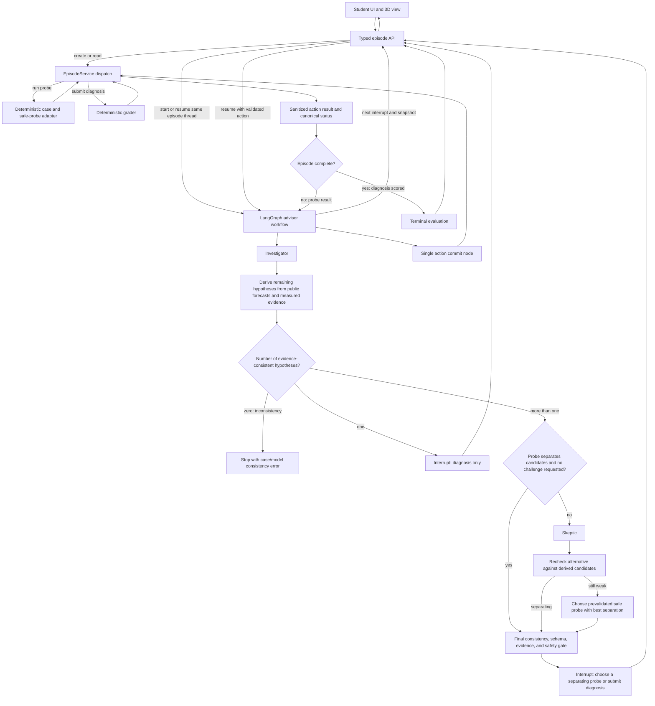

# TwinSleuth — build handoff

Use this document as the product brief and implementation plan in a new Codex chat.

## First instruction for the new chat

The user is participating solo in Next Byte Hacks V5, described as an international hackathon, and explicitly selected TwinSleuth. The user wants a real LangChain/LangGraph agentic system, is open to technologies, and has not yet provided the new project's destination folder. Do not contact organizers, submit the project, or deploy it unless asked.

### Current V5 rules snapshot

Independent source QA reached the official V5 page through Devpost's event listing even though direct opening may fail in some research tools. As checked on 2026-10-07, the event runs Oct 6–31, 2026, with submissions due Oct 31 at 5:00 PM EDT. The rules allow teams of 1–4, worldwide participation subject to regional restrictions, require the project to be built during the event, and disallow previously submitted or completed projects. The judging rubric gives equal weight (25% each) to Innovation & Creativity, Technical Complexity, Functionality & Execution, and Presentation & Clarity. Submissions require an accessible source repository and a 2–5 minute demo video in the rules. The overview instead says 1–3 minutes, lists only Impact as a judging criterion, and asks for 2–3 screenshots; the rules list four equal-weight criteria and ask for screenshots and/or images. Target a 2–3 minute video, frame impact explicitly, and include 2–3 screenshots to fit both descriptions. Reopen the official pages before relying on these details:

- [V5 overview](https://next-byte-hacks-v5.devpost.com/?ref_content=default&ref_feature=challenge&ref_medium=portfolio)
- [V5 rules](https://next-byte-hacks-v5.devpost.com/rules)
- [V5 schedule](https://next-byte-hacks-v5.devpost.com/details/dates)

There is conflicting eligibility text across the V5 overview/about/rules: some sections say students and/or above legal age of majority; another says 13+ or the regional minimum. The user says they are participating, so do not interrupt the build to question that. If submission eligibility advice becomes necessary, flag the discrepancy and ask only for the minimum missing confirmation. The V5 rule against completed/prior projects makes a clean-room implementation the default; do not reuse Vantage code or assets unless the event permits it and provenance/permissions are clear.

Map the MVP to the actual rubric: **innovation** is the learner choosing and defending a safe experiment; **technical complexity** is the real conditional LangGraph loop and deterministic tool boundary; **functionality** is the complete repeatable diagnosis flow; **presentation** is the clear 2–5 minute demo. The 25% technical criterion justifies genuine orchestration, while equal-weight functionality and presentation mean the working vertical slice comes first.

### Builder context and preferences

- Public profiles: [resume](https://tayebbb.github.io/Resume/) and [GitHub](https://github.com/Tayebbb). Re-read them for current evidence; do not invent qualifications.
- The user says they made substantial original contributions to [Vantage Arm Lab](https://github.com/Tayebbb/Vantage-Arm-Lab), but the repository is collaborative and includes upstream/organizer content. Treat contribution scope as user-reported until checked file by file.
- The user is solo, prefers online research over relying on interviews, and is open to any stack. Students are a preferred audience, but robotics was selected for the user's demonstrated build advantage, not because robotics automatically wins.
- The user asked for plain-language explanations and a system design that makes implementation efficient and reduces later optimization.
- The new project must be built outside `E:\isd-sd`; ask once for the absolute target path before file operations.

## Product in one minute

**TwinSleuth is a robotics diagnosis lab for students.** A robot task fails in a way that fits multiple possible causes. Before acting, the learner sees the expected result of each safe probe under each public hypothesis. The LangGraph Investigator proposes a test; a deterministic precheck measures whether its expected outcomes separate the remaining causes; when a proposal is weak or ambiguous, the Skeptic challenges it. The learner chooses, sees the simulator's deterministic observation, and defends a diagnosis against a replayable evidence trace.

**Pitch:** “Choose a safe robot test that separates the likely faults, then see exactly what the evidence supports.”

**Impact hypothesis:** a browser-based case could let students practice safe diagnosis without access to a physical robot. Frame this as an access/practice goal, not a proven learning gain or cost saving.

This is an educational simulation, not a robot controller or a claim of real-world safety. Robot-fault training, conversational assistants, and scored evidence already exist. TwinSleuth's candidate distinction is making each probe's predicted diagnostic value explicit before action, then comparing that forecast with a deterministic result in an auditable trace. Treat this as a product hypothesis to validate against prior systems—not a proven market gap or a uniqueness claim.

## Why this idea, and what the research does not prove

The user has substantial original experience in Vantage Arm Lab and confirmed doing significant original work on it. That provides domain and implementation experience even if the event requires a clean-room codebase; do not count Vantage code/assets as reusable. The bet is on a visible, technically credible demonstration the user can finish—not on robotics being inherently more likely to win.

One earlier reviewer gave the evolved concept rough scores of **6/10 novelty, 7.5 need, 7.5 agentic fit, 9 demo clarity, and 6.5 solo feasibility**. These are historical subjective judgments, not measured probabilities or V5 scores. The novelty score predates this closer prior art and should be treated as stale. Feasibility depends strongly on the clean-room scope and deadline. SimInsights' ARM Institute case study is a close precedent: it describes a VR assessment of a pneumatic fault on a palletizing robot, detailed evidence from learner actions, SME-defined scoring with step-level feedback and remediation, and conversational virtual humans in supervisor and technician roles. SimInsights' current Skillful experience also advertises a structured diagnostic procedure, learner-progress tracking, and a voice-based in-scene SimGenie assistant that gives contextual hints. Therefore, robot-fault training, AI assistance, action evidence, and competency scoring are established precedents; do not claim any of these alone is unique. The narrower candidate distinction is an explicit, pre-action comparison of a safe probe's predicted outcomes across competing hypotheses, followed by conditional agent critique and a replayable comparison with the measured result. This feature-level novelty remains unverified. Recheck the closest products before coding; if they offer the same forecast-and-test loop, narrow or pivot the concept. The 2026 X-MAIN paper describes student robotics maintenance and fault-diagnosis training. Do not claim TwinSleuth is the first AI robot diagnosis lab or claim demonstrated learning gains.

Recent high-profile hackathon winners suggest useful demo patterns, not a winning formula: a narrow task, a visible intermediate result, an AI step that changes what happens next, and a reliable artifact a judge can inspect. OpenAI Build Week's Dấu and Mechanica and Anthropic's Claude hackathon projects Medkit and Wrench Board are useful examples. Microsoft's AI Agents Hackathon rubric lists innovation, impact, technical usability, and category fit; NandaHack 2026 tested whether a stock agent could use submitted services from their instructions. These are examples from other events, not evidence about V5. Agent count alone is not evidence of quality; each role in TwinSleuth must make a specific, observable contribution.

The earlier shortlist compared TwinSleuth/Faultline, WeftLab (Jamdani design-to-weave), ClauseCheck, LatencyLab, and several student-impact ideas. TwinSleuth was chosen after weighing prior robotics experience, agentic depth, and demo feasibility against WeftLab's stronger cultural distinctiveness. No winner can be predicted from this evidence. The detailed earlier candidate review is in `E:\isd-sd\docs\hackathon-idea-research.md` if the new chat can access it.

## Critical source, ownership, and scenario checks

Audit these before choosing a scenario or copying anything:

1. Open the current V5 rules and confirm deadline/status, solo eligibility, pre-existing-work restrictions, required technologies, AI-use disclosure, licensing/ownership terms, and demo requirements. Event rules vary.
2. Inspect Vantage source and Git history at file level. The public repository is marked as a fork of an IUT hackathon project, identifies team work, includes organizer-provided starter-kit resources, and has no clear project-wide license. Its LICENSES.md says package licenses do not relicense organizer resources. The user reports substantial original contributions, but that does not establish rights to every teammate, upstream, or organizer-provided file. Credit contributors accurately.
3. **Default to clean-room implementation for this event.** Write new code and use original or permission-cleared visuals in the new project. Only reconsider reuse of Vantage code, URDF, or organizer resources if the exact V5 rules permit it and every reused file's rights and attribution are clear. A separate folder does not make a completed prior project eligible.
4. Reinspect the simulator's actual runtime and safety APIs before promising a fault. Current public source review found that Vantage's joint values represent commanded positions and its TCP is a rendered pose; it does not currently expose an independent encoder/plant feedback channel. **Do not use “frozen encoder” as an existing capability.** That scenario would require a new explicit plant-versus-sensor model.
5. The earlier pick-and-place/drop-object story is also unsupported by the documented stylus/keypad simulator and must not be carried forward without source evidence.

The preferred first case is a **failed keypad press or deterministic safety-rejected motion** inspired by Vantage's documented PIN-entry and safety pipeline. The safety module defines codes such as locked-joint, inactive-joint, joint-limit, velocity-limit, and E-stop; the runtime exposes a generic rejection and recent in-memory events. This is not an existing server probe API or durable diagnostic report. These are leads to inspect, not a finished case design. Select one case only after confirming that its safe probes return distinct, observable evidence for at least two plausible causes. Candidate probes might inspect the attempted target or run a non-moving IK/reachability/safety preview; use only operations the clean-room implementation actually supplies. If the failure code reveals the answer immediately or the probes cannot distinguish hypotheses, redesign the case before building the UI. A new sensor/plant fault model is an optional, larger scope—not the default.

For the clean-room MVP, keep the lesson and evidence loop. Make a small pedagogical robot visualization from original primitives and implement one deterministic safety/PIN case. Do not attempt to recreate a production-grade six-axis simulator.

## System design: one authority, one event history

Keep one TypeScript application/repository as a modular monolith: a browser UI and one small Node server. Because V5 forbids previously completed projects and Vantage's reuse rights are unresolved, assume clean-room source and original visuals. Use LangGraph.js and LangChain.js as requested; verify current official APIs while implementing. Avoid microservices and extra agent frameworks.

The **EpisodeService and its SQLite event ledger are the source of truth**. The browser sends typed learner actions to the API. The API validates the request and resumes that episode's graph; it does not separately run the probe or write the action. A single graph action node calls EpisodeService, which validates the expected revision, runs the deterministic scenario operation, appends the evidence, and returns the canonical sanitized snapshot. The 3D view only renders that returned snapshot. It never sends client-computed telemetry or scores back as evidence. The graph may call only this explicit, idempotent action operation; it cannot issue arbitrary robot commands.

### Domain boundaries and contracts

- **EpisodeService:** starts/resets a seeded case and is the only writer for probe/diagnosis actions. Its transaction checks episode status/revision, runs the deterministic operation, records the result, advances the revision, and returns the public projection. It dispatches a probe result back into an open graph turn, but a completed diagnosis returns the final evaluation and ends the graph.
- **Case adapter:** owns the deterministic simulated scenario, fixed safe-probe list, and a public authored prediction for each hypothesis/probe pair. Forecasts are authored teaching-model predictions, not measured evidence. It returns the actual measured result with a stable evidence ID; it has no model-generated commands. It can precompute safe probes that split any remaining candidate set and a deterministic best-separation fallback.
- **Evidence ledger:** append-only events distinguish initial symptom, forecast/proposal shown, probe selected, measured probe result, rejected unsafe action, and diagnosis submitted. Build the current UI snapshot from this history so a judge can replay what was predicted, chosen, and observed.
- **Agent graph:** consumes the learner-visible symptom, public hypothesis catalog, public probe-outcome model, approved probe descriptions, and observed evidence. Its checkpoint is derived from the ledger and contains no private answer-key field.
- **Grader:** runs only after diagnosis is locked. It reads a server-only answer/rubric resolver and returns a deterministic score with criterion-level evidence references.
- **Shared contracts:** use Zod schemas for public API actions, episode projections, evidence events, model outputs, and errors. Keep private answer-key types in server-only modules and never export them to the browser bundle.

Define separate schemas: PublicDiagnosticModel contains learner-visible hypothesis IDs/descriptions, safe probes, and the authored forecast for each hypothesis/probe pair; PrivateEpisodeTruth contains the actual hypothesis, private seed/parameters, and grading key in server-only modules. Never serialize or pass a combined case object to the browser or graph. All Investigator and Skeptic outputs must use public hypothesis/probe IDs and cite existing evidence IDs; validate their forecast claims against the public model. The model must not invent diagnoses or results the grader and simulator cannot score.

Every action carries a server-generated unguessable episode ID, a unique action ID, and the expected episode revision. Inside one SQLite transaction, EpisodeService first checks whether the action ID exists. If the canonical request payload matches, it returns the stored result; if the ID is reused with different input, it returns a conflict. For a new action, it atomically checks the revision, validates the probe or diagnosis, appends action and result events, advances the revision, and stores the response. A crash after commit but before graph checkpoint/HTTP response is safe: graph resume replays the same action ID and gets the saved result without duplicating evidence.

Suggested public API shape (adapt to the chosen framework):

- Create episode: POST /api/episodes
- Read sanitized episode: GET /api/episodes/:episodeId
- Choose safe probe or submit diagnosis: POST /api/episodes/:episodeId/actions

Use a discriminated action union such as run_probe or submit_diagnosis. The POST handler validates the public request and resumes the current graph with that action and the same server-derived thread ID. The graph's single action node calls EpisodeService; do not also execute the action in the HTTP handler. Branch on EpisodeService's canonical episode status after commit: a probe result in an open episode returns to Investigator/precheck, while a scored diagnosis returns a terminal evaluation and ends the graph—never issue another interrupt after completion. Return the new revision, public hypothesis catalog, allowed actions, evidence items, agent messages, and final evaluation only when available. Do not accept graph thread IDs from the browser or expose private case configuration.

### Agent graph: real roles with bounded authority

Use a LangGraph StateGraph with typed shared state, conditional routing, a learner interrupt, and a persistent checkpointer. Create one server-derived thread ID per episode and resume that same thread with the learner's action. Keep the interrupt node free of model calls and side effects: it only asks for a typed choice; after resume, a separate action node calls EpisodeService. LangGraph re-runs the interrupted node from its beginning when resuming, so the action must not be performed before the interrupt. Treat the graph checkpoint as a resumable advisor trace—not the database of record.

1. **Investigator (LLM):** reads the evidence ledger and public forecast model; proposes plausible causes and one safe probe, showing its expected result under each candidate hypothesis. Every claim about what happened must cite observed evidence IDs; forecasts must be labeled as predictions. It may only name hypothesis and probe IDs from server-provided schemas.
2. **Skeptic (LLM, conditional):** challenges the Investigator when its proposed probe has identical forecast outcomes for competing hypotheses, the evidence is ambiguous, or the learner asks for a challenge. It points to the specific forecast collision and suggests a more separating approved probe. Script the demo so it catches a real weakness; otherwise remove the second LLM call.
3. **Deterministic precheck and gate:** derives remaining hypotheses by filtering the public catalog against all measured observations and the authored forecast table; never trusts an LLM-selected subset as the candidate set. If exactly one hypothesis remains, offer diagnosis only; if zero remain, stop with a case/model consistency error. When more than one remains, compute whether a proposed safe probe splits those candidates and route weak proposals to the Skeptic. After at most one Skeptic call, a final check validates the replacement; if it still fails to separate candidates, use a prevalidated safe probe with the best deterministic separation score and a fixed tie-break. If no safe probe can split a multi-hypothesis set, the case is invalid and must be redesigned. Forecasts remain separate from measured evidence. The learner chooses; the agent never moves the arm.
4. **Action node:** routes the learner's typed choice to EpisodeService. EpisodeService is the only place that executes a deterministic probe, appends measured evidence, or invokes the grader; action IDs make retries safe.
5. **Deterministic grader:** after submission, scores diagnosis, useful evidence selection, and safe/informative probing against an authored rubric. LLM outputs never set measurements, safety outcomes, or points.

Prefer one Investigator call per new evidence state. Route to the Skeptic only when its critique can change the proposed test or when the learner asks. This preserves meaningful multi-agent reasoning while limiting latency and API cost. When a model response fails validation or times out, fall back to a fixed, clearly labeled scenario recommendation; never pretend the fallback was generated by a live agent.

Use the current official JavaScript SQLite checkpointer package, `@langchain/langgraph-checkpoint-sqlite`, for this single-server interrupt flow. Keep the episode ledger and checkpoint tables in one local SQLite file where the saver supports it; otherwise use two files with explicit ownership. Do not silently substitute MemorySaver while claiming pause/resume across requests or restarts. If persistent checkpointing proves incompatible with the chosen runtime, remove LangGraph's interrupt and collect the learner choice as a normal API action before starting a fresh graph run from the episode ledger.

### Confidentiality and reliability rules

- Keep the answer key and scoring rules out of client responses, model prompts, graph state/checkpoints, logs, and external traces until the learner locks a diagnosis.
- The probe engine may consult private scenario state, but returns only the measured observation. The graph and learner may receive the public forecast table and measured evidence, never the private truth object or scoring key. Evidence-based inference from those forecasts and observations is the intended task, not a data leak.
- Use structured model output and validate it server-side. An evidence ID must exist in the episode; a probe must be in the allowed list. Treat invalid output as a recoverable agent failure.
- No arbitrary tool calling, free-form motion plans, generated faults, real hardware, or user-provided commands in the MVP.
- Store provider credentials only on the server. If a deterministic demo mode is used because credentials/network are unavailable, label it in the UI and explain that it is the fallback.
- No RAG, embeddings, user accounts, classroom management, voice, WebSockets, or multi-provider routing for the first vertical slice. The case catalog is too small to justify them.

## UI design system — diagnostic bench

### Direction and layout

Use the confirmed **warm lab-notebook** direction: paper-colored workspace, ink-dark text, restrained teal for actions, and precise instrument-like data panels. It should feel like a student investigation tool, not an industrial control console or a generic AI chat. The user selected this over a dark control-room or playful-classroom look because clear evidence comparison matters more than dramatic atmosphere. Optimize the demo workspace for laptop/desktop first and keep it responsive for phones. This gives the robot scene, hypotheses, and evidence table enough room while preserving mobile access.

On a wide screen, use a compact header, a two-column work area, and a full-width evidence timeline: robot scene and symptom on the left; hypotheses, forecast comparison, agent recommendation, and probe choices on the right. Keep the main action visible without scrolling at the demo target of 1280×800. On narrow screens, stack those sections in learning order and allow the forecast matrix and timeline to scroll horizontally with row/column labels kept visible. Do not hide essential evidence inside the 3D scene.

### Token architecture

Keep one CSS-token source of truth, initially in src/styles/tokens.css, organized as primitives → semantics → component aliases. Components must consume semantic or component tokens rather than raw color values. Tailwind can map to these variables; avoid maintaining a separate, competing palette. A dark theme can be added later through semantic overrides, but do not spend MVP time on a theme toggle.

    :root {
      /* Primitives: raw values */
      --p-paper-0: #FEFDF9;
      --p-paper-50: #F6F4ED;
      --p-paper-100: #ECEAE2;
      --p-white: #FFFFFF;
      --p-ink-950: #1B2A2A;
      --p-ink-700: #425657;
      --p-ink-600: #53686A;
      --p-line-400: #C7D1CE;
      --p-teal-700: #116B65;
      --p-teal-100: #DDEFEA;
      --p-indigo-700: #4D478F;
      --p-indigo-100: #E9E7F6;
      --p-amber-800: #805000;
      --p-amber-100: #F6EBD3;
      --p-red-700: #A33E3A;
      --p-red-100: #F7E6E3;
      --p-green-800: #2D6749;
      --p-green-100: #E1EFE6;

      --p-space-1: 0.25rem;
      --p-space-2: 0.5rem;
      --p-space-3: 0.75rem;
      --p-space-4: 1rem;
      --p-space-6: 1.5rem;
      --p-space-8: 2rem;
      --p-radius-sm: 0.375rem;
      --p-radius-md: 0.625rem;
      --p-radius-lg: 0.875rem;
      --p-size-label: 0.875rem;
      --p-size-body: 1rem;
      --p-size-subhead: 1.25rem;
      --p-size-title: 1.5rem;
      --p-leading-body: 1.5;
      --p-weight-medium: 500;
      --p-weight-semibold: 600;
      --p-duration-fast: 150ms;
      --p-font-ui: Inter, "Segoe UI", system-ui, sans-serif;
      --p-font-data: "IBM Plex Mono", Consolas, monospace;

      /* Semantics: purpose aliases */
      --surface-page: var(--p-paper-50);
      --surface-card: var(--p-paper-0);
      --surface-raised: var(--p-white);
      --text-primary: var(--p-ink-950);
      --text-secondary: var(--p-ink-600);
      --border-subtle: var(--p-line-400);
      --action-primary: var(--p-teal-700);
      --forecast-fg: var(--p-indigo-700);
      --forecast-bg: var(--p-indigo-100);
      --observation-fg: var(--p-teal-700);
      --observation-bg: var(--p-teal-100);
      --caution-fg: var(--p-amber-800);
      --caution-bg: var(--p-amber-100);
      --danger-fg: var(--p-red-700);
      --danger-bg: var(--p-red-100);
      --success-fg: var(--p-green-800);
      --success-bg: var(--p-green-100);
      --focus-ring: var(--p-teal-700);
      --space-control: var(--p-space-3);
      --space-panel: var(--p-space-4);
      --space-section: var(--p-space-6);
      --space-page: var(--p-space-8);
      --radius-control: var(--p-radius-md);
      --radius-panel: var(--p-radius-lg);
      --type-label: var(--p-size-label);
      --type-body: var(--p-size-body);
      --type-subhead: var(--p-size-subhead);
      --type-title: var(--p-size-title);
      --leading-body: var(--p-leading-body);
      --font-ui: var(--p-font-ui);
      --font-data: var(--p-font-data);
      --motion-fast: var(--p-duration-fast);

      /* Component aliases */
      --button-primary-bg: var(--action-primary);
      --button-primary-fg: var(--surface-raised);
      --button-radius: var(--radius-control);
      --panel-bg: var(--surface-card);
      --panel-border: var(--border-subtle);
      --panel-radius: var(--radius-panel);
      --forecast-border: var(--forecast-fg);
      --observation-border: var(--observation-fg);
      --probe-selected-ring: var(--focus-ring);
    }

### Core component contracts

| Component | What it communicates | Required behavior |
|---|---|---|
| Case header | Case name, current step, reset, episode status | Keep reset secondary; confirm before resetting a completed investigation. |
| Robot viewport | Symptom context and visual state | Provide a text summary of important state; never make the 3D view the only evidence source. |
| Hypothesis list | Public candidate causes and evidence status | Show unresolved/supported/weakened labels with evidence IDs; never display private truth before submission. |
| Forecast matrix | Predicted outcome for each candidate under an approved probe | Label every forecast “PREDICTED”; use a dashed indigo border and prediction icon. Keep values identical to the authored public model. |
| Investigator/Skeptic cards | Proposed test and critique | Name the role; state one concise recommendation and its reason; cite evidence IDs. Show Skeptic critique only when it changes the proposed test or the learner asks. |
| Probe choice | Safe learner action | Show only final-gate-approved probes that split the current candidates. Show a deterministic separation summary, such as “distinguishes 2 of 3 causes”; never let the LLM supply this score. |
| Evidence timeline | What was predicted, chosen, and observed | Label forecasts separately from measured results; show timestamps, stable evidence IDs, and the learner action in order. |
| Diagnosis debrief | Learner result and rubric | After submission, show diagnosis, evidence use, probe quality, criterion-level score, and a short evidence-linked explanation. |

### States, accessibility, and motion

- Forecasts use an indigo dashed outline and the text/icon label **PREDICTED**. Measurements use a solid teal outline and **OBSERVED**. Never rely on color alone or reuse the forecast card as though it were a measurement.
- Probe controls define default, keyboard-focus, selected, loading, disabled, and completed states. During a request, disable duplicate actions and announce “Running test”; after the response, announce the measured result in a polite live region.
- Skeptic warnings use amber plus a plain-language explanation. Errors use red plus actionable text. A deterministic fallback must be labeled “Recommended safe test” and explain that the agent response could not be validated.
- Use a visible 2px focus ring, logical keyboard order, semantic buttons/radios, readable labels, and at least 44px touch targets on mobile. Keep body text at 16px where space allows and maintain at least 4.5:1 text contrast. The listed foreground/background pairs were checked at a minimum 5.26:1; recalculate if colors change.
- Use short transitions for focus/selection only. Respect prefers-reduced-motion; never animate the robot in a way that conveys a measurement the simulator did not produce.

Before polishing, implement the forecast card, probe choice, observed-result state, and diagnosis debrief as one connected screen. Confirm a judge can tell prediction from measurement at a glance and can complete the path without relying on color, audio, or hidden hover behavior.

## MVP and build order

### Phase 0 — unblock the destination and rules

Ask once for the absolute target folder. Reopen the official V5 overview, rules, and schedule from the Devpost listing if a direct URL is blocked. Confirm eligibility with the user if the conflicting age/student terms affect them. Record the deadline, required demo/repo, and that all main project work must be new for the event. Use clean-room source and original visuals by default. Inspect Vantage only to ground a feasible scenario and avoid copying its code/assets.

### Phase 1 — lock one diagnosable case

Write the scenario as a short case card before UI work: initial symptom, two or three hypotheses, safe probes, the public predicted outcome for each hypothesis/probe pair, private actual cause, grading rubric, a non-discriminating Investigator proposal for the Skeptic to catch, and a prevalidated safe fallback. Ensure every competing hypothesis pair can be separated by at least one safe probe and that the hidden episode result matches its hypothesis forecast. If not, change the case.

### Phase 2 — prove the smallest complete journey

Before polishing the graph or 3D scene, implement a skeletal end-to-end slice: one repeatable symptom, one safe deterministic probe, one evidence event, diagnosis submission, and rubric result. The screen can be plain and the arm can be a static/original primitive visualization. This proves that the case is diagnosable and that the full learner journey works.

### Phase 3 — add the agent workflow

Add the LangGraph Investigator, conditional Skeptic, typed gates, interrupt/resume, and persistent SQLite checkpointer around the working slice. Keep the action commit in EpisodeService as the only write path. Then add the richer original 3D projection and replay/debrief UI. Keep one local start command and a short README setup path. Use one server and one database; do not split services to look more complex.

### Phase 4 — judge-ready interaction

Make one repeatable judge path that takes under two minutes: visible symptom → Investigator shows competing causes and forecast outcomes → a weak probe forecast collides across causes → Skeptic explains why it will not distinguish them and proposes a separating safe test → the deterministic final gate confirms the alternative or supplies its labeled best-separation fallback → learner chooses → simulator returns the measured result → learner submits a diagnosis → evidence-linked score/debrief. Reset and replay it reliably. Target a 2–3 minute submitted video to fit both published V5 duration ranges; frame impact explicitly and include 2–3 screenshots. Show actual agent steps without exposing private truth or the scoring key.

### MVP acceptance checklist

- Reset produces the same seeded symptom and repeatable probe results.
- Only listed safe probes can run; unsafe/unknown actions are refused with a plain explanation.
- The 3D view shows the exact canonical state returned by the server.
- Each completed probe adds an immutable evidence item with a stable ID and timestamp.
- The case's authored public forecast table shows expected probe outcomes under each public hypothesis and is independent of private episode truth; forecast cards are visibly distinct from measured evidence.
- Every competing hypothesis pair in the case can be separated by at least one approved safe probe, and the measured result matches the private cause's forecast.
- The candidate set is derived from public predictions and measured evidence, not from the Investigator's chosen subset. A singleton offers diagnosis only; an empty set surfaces a consistency error; multiple candidates offer only probes the final deterministic check verifies will split them, plus diagnosis submission.
- After one Skeptic challenge, a prevalidated separating fallback is used if needed. A probe result resumes investigation; a scored diagnosis ends the graph and returns the final evaluation.
- The Investigator cites observed evidence, labels predictions, and recommends only valid probe IDs.
- A deterministic precheck detects a non-discriminating proposal; the Skeptic cites its forecast collision and can change the proposed test. A second deterministic check rejects any weak replacement; after one challenge, a prevalidated separating fallback is used or the case fails validation.
- Every model output uses a public hypothesis ID from the case contract; no unscored, invented diagnosis appears.
- The short judge path can be reset and replayed, with a deterministic simulated observation and a visible consequence from the Skeptic's contribution.
- Submitting a diagnosis ends the graph on the completed episode status; it cannot loop back into another investigation interrupt.
- Replaying a request with the same action ID cannot add duplicate evidence or motion.
- Before diagnosis submission, no API response or graph/checkpoint context contains the private answer-key field, private episode state, or scoring key. The agent may infer a cause from public forecasts and measured evidence, which is the intended task.
- The final evaluation is reproducible and explains how the selected evidence supports or weakens the diagnosis.
- A live-model failure leaves a clearly labeled demo fallback, not a broken core flow.

### Keep outside the first version

Multiple arms/cases, pick-and-place or gripper behavior unless the source proves it exists, physical hardware, ROS, arbitrary movement, model-generated fault injection, accounts/classes, broad RAG, long-term agent memory, streaming infrastructure, cloud deployment, and claims of industrial readiness or proven learning outcomes.

## Independent critique and revision loop for the new chat

Before coding, do the requested independent validation without biasing the first pass:

1. If subagents are available, send three separate briefs that include only the short concept, user constraints, and hackathon link. Do not give them this handoff's scores or conclusions on round one. Assign: (a) product/judge and competing ideas, (b) architecture/trust/reliability, and (c) solo delivery and demo. Ask each to browse primary sources, independently rate novelty, need, agentic fit, demo clarity, and solo feasibility from 0–10, name fatal assumptions, and return concise evidence-backed changes. Do not ask them to edit files.
2. In parallel, verify current first-party event rules, Vantage source contracts/provenance, current LangGraph JS interrupt/checkpointer/structured-output docs, and nearest products/papers. Keep unknowns marked unknown.
3. Synthesize disagreements, revise the concept and architecture once, then give the revised design to the same reviewers for a second red-team round. Do not pursue numeric consensus. Fix every P0/P1 issue or state the exact remaining dependency. A third targeted round is warranted only if a new P1 issue remains.
4. If subagents are unavailable, perform the three roles as separate adversarial passes and disclose that they were not independent reviewers.
5. After the loop, implement in the user's target folder and preserve the selected goal and constraints. Do not endlessly restart ideation or expand the MVP.

Prior independent reviews already made these improvements, but the new chat should verify them rather than trust stale assumptions: sharper learner-led positioning; no encoder or dropped-object premise without source support; a source/eligibility gate for Vantage reuse; a conditional, consequential Skeptic role; and a server-authoritative episode/evidence/grade boundary. A new competitor audit found SimInsights/ARM Institute prior art with VR robot-fault diagnosis, conversational AI, and scored action evidence. Treat the pre-action forecast-and-critique loop as a differentiation hypothesis, and have the first independent reviewers check whether close products already provide it before coding.

## Primary research links to recheck

### Project, provenance, and contest

- [Next Byte Hacks V5 overview](https://next-byte-hacks-v5.devpost.com/?ref_content=default&ref_feature=challenge&ref_medium=portfolio), [rules](https://next-byte-hacks-v5.devpost.com/rules), and [schedule](https://next-byte-hacks-v5.devpost.com/details/dates) — QA reviewer verified the official content through Devpost's event listing: Oct 6–31, 2026; Oct 31 5:00 PM EDT submission deadline; team size 1–4; worldwide subject to restrictions; previously submitted/completed projects disallowed; public source link. The overview says a 1–3 minute demo, lists only Impact as a judging criterion, and asks for 2–3 screenshots; the rules say 2–5 minutes, four equal-weight criteria, and “screenshots and/or images.” Target a 2–3 minute video, frame impact explicitly, and include 2–3 screenshots. The pages also conflict on age/student eligibility. Recheck before submission.
- [Vantage Arm Lab repository](https://github.com/Tayebbb/Vantage-Arm-Lab) — public README describes a browser-based 6-DOF URDF twin, telemetry, PIN entry, and deterministic safety checks; re-read actual source before selecting the episode.
- [IUT Final Hackathon upstream repository](https://github.com/md-sazid9089/IUT_FINAL_HACKATHON) — provenance context for the Vantage fork.
- [Vantage TelemetryPanel](https://github.com/Tayebbb/Vantage-Arm-Lab/blob/main/src/ui/TelemetryPanel.tsx), [RuntimeController](https://github.com/Tayebbb/Vantage-Arm-Lab/blob/main/src/runtime/RuntimeController.ts), [RobotModelAdapter](https://github.com/Tayebbb/Vantage-Arm-Lab/blob/main/src/robot/RobotModelAdapter.ts), and [safety rules](https://github.com/Tayebbb/Vantage-Arm-Lab/blob/main/src/runtime/safety.ts) — source paths cited in independent code review; verify they still match the target branch. The runtime rejection log is in-memory; this is not already a server probe API or durable case ledger.
- [Vantage starter-kit manifest](https://github.com/Tayebbb/Vantage-Arm-Lab/blob/main/KIT_MANIFEST.json), [START_HERE](https://github.com/Tayebbb/Vantage-Arm-Lab/blob/main/START_HERE.md), and [LICENSES.md](https://github.com/Tayebbb/Vantage-Arm-Lab/blob/main/LICENSES.md) — provenance, immutable organizer resources, and package licenses.
- [GitHub licensing guidance](https://docs.github.com/en/repositories/managing-your-repositorys-settings-and-features/customizing-your-repository/licensing-a-repository) — a public repository without a license does not grant broad reuse rights.
- [Devpost guidance on event rules](https://help.devpost.com/article/140-creating-hackathon-rules) — confirms event-specific rules must be checked; it cannot substitute for V5 rules.

### Product overlap and hackathon signals

- [SimInsights/ARM Institute robotic technician assessment case study](https://www.siminsights.com/wp-content/uploads/2023/11/ARM-Case-Study-On-Virtual-Reality-Based-Robotic-Technician-Assessment-Test.pdf) — close prior art: a VR pneumatic-fault assessment on a palletizing robot with detailed learner-action evidence, SME-defined scoring, step-level feedback/remediation, and conversational virtual humans.
- [SimInsights Skillful fault-diagnosis simulation](https://platform.siminsights.com/skillful/fault-diagnosis-mr-timed-933?from=Manufacturing) — a mixed-reality palletizing-robot fault-identification experience with a structured diagnostic procedure, progress tracking, and a voice-based, in-scene SimGenie assistant offering contextual hints. Do not claim those features are unique.
- [X-MAIN robotics maintenance/diagnosis study](https://www.mdpi.com/2813-2084/5/4/47) — academic prior art in student robotics fault diagnosis.
- [OpenAI Build Week winners](https://developers.openai.com/blog/build-week-winners) and [Anthropic Claude hackathon winners](https://claude.com/resources/articles/meet-the-winners-of-built-with-opus-4-7-claude-code-hackathon) — inspect the actual winning project descriptions; these examples do not predict V5 results.
- [Microsoft AI Agents Hackathon](https://microsoft.github.io/AI_Agents_Hackathon/) and [NandaHack 2026](https://nandahack.media.mit.edu/) — Microsoft lists innovation, impact, technical usability, and category fit; NandaHack describes testing whether a stock agent can use a submitted service from its instructions. These are other-event examples, not V5 criteria.

### Implementation references

- [LangGraph.js: Thinking in LangGraph](https://docs.langchain.com/oss/javascript/langgraph/thinking-in-langgraph)
- [LangGraph.js: Graph API](https://docs.langchain.com/oss/javascript/langgraph/graph-api)
- [LangGraph.js: interrupts](https://docs.langchain.com/oss/javascript/langgraph/interrupts)
- [LangGraph.js: persistence](https://docs.langchain.com/oss/javascript/langgraph/persistence)
- [LangGraph.js SQLite checkpointer reference](https://reference.langchain.com/javascript/langchain-langgraph-checkpoint-sqlite/SqliteSaver)
- [LangGraph.js persistence package guide](https://github.com/langchain-ai/langgraphjs/blob/main/docs/docs/concepts/persistence.md) — documents the JS SQLite saver package and per-thread checkpoint model.
- [LangChain.js structured output](https://docs.langchain.com/oss/javascript/langchain/structured-output)

Re-read current official docs before coding; APIs, package names, event terms, and product availability may change. Keep this handoff as the brief, but adapt implementation details to the verified target repo and deadline.
